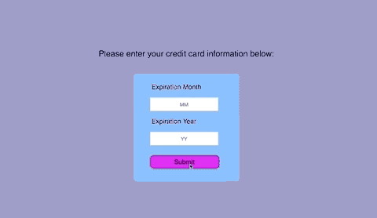
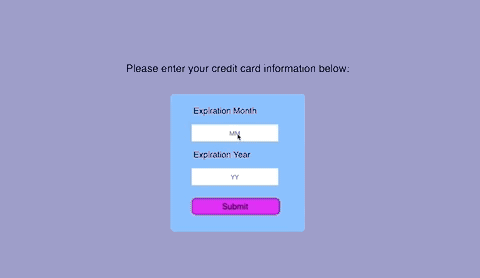
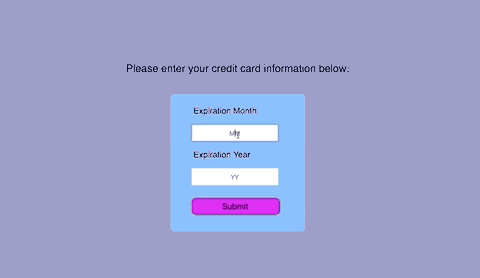

### jQuery Validation Exercise

**Technologies used:** JavaScript, jQuery

**Goal:** To create a form consisting of two fields and a submit button which represent the credit card payment section of an online transaction. The first field and second field represent the expiration month and expiration year, respectively. The following jQuery validation plugin was used <https://jqueryvalidation.org/>.

If the user tries to submit an empty form, the user would be prompted with messages to fill them out.

If the user incorrectly fills out the form, a message will prompt the user to input a valid month.

​			

If the information has been correctly entered, the form will be submitted.

